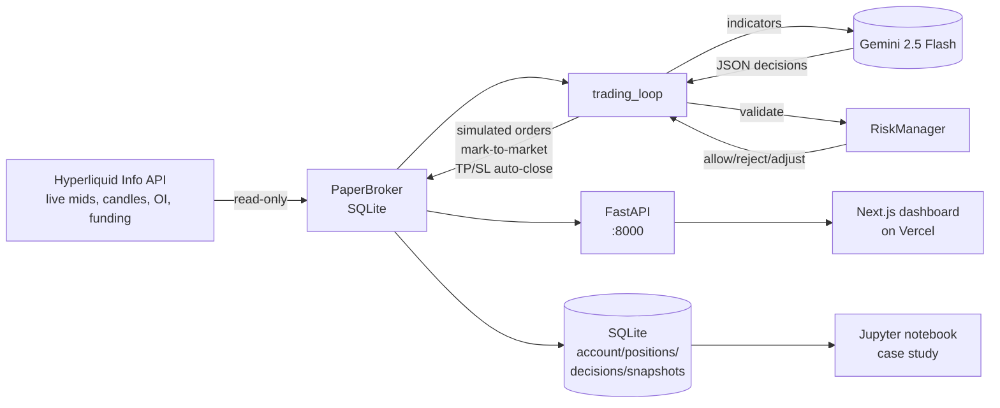

# jarvis — LLM-in-the-loop paper trading on Hyperliquid

_A portfolio case study. 1,500 words. Zero-cost build. Written to be read in ten minutes._

> I build systems that make complex things run quietly — across operations, automation, and the spaces where people and technology meet.

## The problem

A modern LLM can read a chart in plain English, recite the technician's playbook (EMAs, MACD, RSI divergences, funding rates), and synthesize them into a trade thesis that sounds disciplined. Whether it _trades_ disciplined is a different question. Prompt-engineered trading agents lean on LLM reasoning for decisions, but most demonstrations either (a) use toy simulators with clean data, (b) skip the engineering work of feeding the model real-time state, or (c) plug into real exchanges and quietly lose money on live capital.

The question I wanted to answer for myself: **if you wire an off-the-shelf LLM into a real market's data feed, with real-enough execution mechanics and hard risk guardrails, does its decision process hold up over a month of paper trading — or does it quietly underperform a naive buy-and-hold baseline?**

This project is the instrument for that answer. It is a paper-trading agent for Hyperliquid perpetual futures, driven by Google's `gemini-2.5-flash`, that runs autonomously on a free-tier cloud VM and logs every decision, indicator reading, and simulated fill to a local SQLite database. The entire system costs ₹0/month to run.

## The architecture, in one diagram

The loop is mundane on purpose. Every `INTERVAL` (default 1h):

1. Mark to market. Check whether any open position has hit its take-profit or stop-loss; close if so.
2. Refresh account state from the SQLite `account` and `positions` tables.
3. Pull live Hyperliquid candles (5m and 4h) for each tracked asset, compute indicators locally (EMA, RSI, MACD, ATR, Bollinger, ADX, OBV, VWAP).
4. Build a JSON context: account state, risk limits, per-asset market data, and the system's running history. Hand it to Gemini with a prompt that asks for a strict JSON response — one decision per asset — and a long-form rationale.
5. For each decision, run `RiskManager.validate_trade`: position-size cap, total exposure cap, leverage cap, daily drawdown circuit breaker, mandatory stop-loss. The LLM cannot override these.
6. Route the surviving orders through `PaperBroker`, which opens a position row in SQLite at the live market price (plus 0.05% slippage to keep the numbers honest).
7. Log the cycle — every indicator snapshot, every rationale, every decision — so a Jupyter notebook can reconstruct what happened months later.

## The engineering choices

**Gemini over Claude.** The reference implementation I built on (Sanket Agarwal's open-source [hyperliquid-trading-agent](https://github.com/sanketagarwal/hyperliquid-trading-agent)) uses Claude. I swapped in `gemini-2.5-flash` because Google's free tier covers 250 requests per day with no credit card — plenty for a 1h cycle — while preserving the same interface so the LLM layer is swappable. If the case study shows Gemini underperforming, I can rerun with Claude or GPT-5 and hold everything else constant.

**Paper mode as a physically enforced invariant.** The safety property I wanted was stronger than "don't place real orders if a flag is true." A careless edit to the config loader could bypass that. Instead: when `PAPER_TRADING_MODE=true`, the module that wraps Hyperliquid's `Exchange` client refuses to instantiate it; the `Exchange` object is literally `None`. Any attempt to call an order method would raise an `AttributeError` before it could reach the SDK. On top of that, `main.py` asserts the flag at boot. The real-money execution path is not available at runtime.

**SQLite as the durable store.** Four tables — `account`, `positions`, `decisions`, `candles_snapshots` — chosen so any later analysis can reconstruct the exact state the model saw when it made each decision. This is the property that converts the project from "an agent that trades" into "a dataset I can study."

**Oracle Cloud Free Tier.** The Always-Free ARM Ampere A1 VM (4 OCPU, 24 GB RAM) is absurdly over-specced for this workload, which matters because "free forever" is the constraint. Ubuntu 22.04, Python 3.12 via deadsnakes, Poetry for dependencies, a `systemd` unit that restarts on crash and on reboot. One shell script, idempotent, sets the whole box up in about four minutes.

**Vercel for the dashboard.** The Next.js dashboard is a single page that polls four FastAPI endpoints every 10 seconds. No auth (the paper state is not sensitive), no state management library, no analytics pixels. Vercel Hobby is free for personal projects. The mixed-content problem — a Vercel HTTPS page calling an HTTP backend — is solved with Caddy + Let's Encrypt or a Cloudflare Tunnel, both free.

## What I learned

[FILL IN AFTER 4-WEEK RUN]

Honest versions of these notes belong here after the agent has traded for a month:

- **Decision quality by keyword.** Which of the LLM's stated reasons correlate with winning trades vs losing ones? Going in, my prior is that trend-following rationales ("4h EMA20 above EMA50, MACD histogram expanding") will outperform reversal rationales ("RSI oversold, bounce likely").
- **Churn discipline.** The system prompt asks for hysteresis — stronger evidence to change a decision than to hold it. Did the LLM actually respect it, or did it flip directions on every minor indicator wobble?
- **Drawdown profile.** Max drawdown vs the daily-drawdown circuit breaker I set at 10%. Did the circuit breaker ever trip? If yes, was it because of a real regime shift or model noise?
- **Baseline gap.** The notebook computes an equal-weight buy-and-hold baseline over the same window. A result where the agent roughly matches buy-and-hold in an up-market but protects capital better in a drawdown would be more interesting than a narrow outperformance that barely survives sample error.

## What I'd do differently

[FILL IN AFTER 4-WEEK RUN]

The interesting items to revisit after live data:

- **Regime-aware prompting.** If RSI-oversold reversal trades turn out to be systematic losers in trending regimes, the cleanest fix is adding a regime label (ADX-based, trending vs chop) to the context so the LLM can suppress mean-reversion logic when ADX is high.
- **Funding-rate cost.** The paper broker currently ignores funding-rate P&L. For a 1h cycle this is probably material on held positions. Next iteration: track funding accrual per position using the live funding rate.
- **Execution realism.** Fixed 0.05% slippage is a crude model. A more honest version would model slippage as a function of order size vs current book depth (which the Hyperliquid Info API exposes).
- **A/B the LLM.** Same prompts, same market feed, same risk rails, Claude vs Gemini vs local model. Currently the LLM layer is a single class behind a shared interface — the substitution would be ~50 lines.

## Why this matters to me

Trading is an excuse. The substrate of the project is interesting independently:

1. **A real system with live data, not a toy.** Hyperliquid's WebSocket and REST endpoints, real candles, real funding rates, real order book depth.
2. **A structured LLM-in-the-loop architecture with hard external guardrails.** The model suggests; the deterministic layer disposes. This is the pattern I think generalizes to most "LLM agent" problems — finance, ops, scheduling, triage.
3. **A dataset designed for retrospective study.** Every prompt, every response, every indicator snapshot, every simulated fill, in a queryable SQLite file. You can ask questions months later that you didn't know to ask when the data was being collected.
4. **Demonstrably zero marginal cost.** Oracle Always Free + Vercel Hobby + Gemini Free Tier + SQLite. The infrastructure story matters because the alternative is the common failure mode of personal projects: "it was running until the trial expired."

## Try it

- Main repo (Python bot + PaperBroker + FastAPI): [github.com/<you>/hyperliquid-agent-jarvis](https://github.com) _(push target — update after pushing)_
- Dashboard (Next.js on Vercel): [jarvis.yourdomain.com](https://example.com) _(update after Vercel deploy)_
- Architecture notes: [ARCHITECTURE_NOTES.md](ARCHITECTURE_NOTES.md)
- Case-study notebook: [analysis/case_study.ipynb](analysis/case_study.ipynb)

If you want to fork and run it on your own assets, every piece of it — Python code, systemd unit, Caddy config, Vercel env vars, Jupyter cells — is in the repo. The `deploy.sh` script will have you up in about five minutes.
